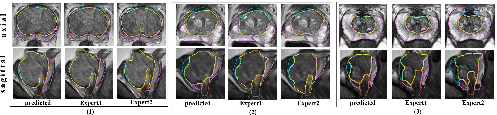

# Zonal Segmentation of the Prostate

This repository enables the segmentation of prostatic zones (peripheral zone, central gland, AFS and distal prostatic urethra) from T2-weighted MRI. The work was published in **'Towards Patient-Individual PI-RADS v2 Sector Map: CNN for Automatic Segmentation of Prostatic Zones ror T2-Weighted MRI' (ISBI 2019).** The preprint can be found in this repository.

## Algorithm description
Details on the algorithm can be found in the attached paper. The inputs for the preprocessing of the algorithm are the three orthogonal T2-weighted volumes (transversal, coronal and sagittal). They are used to create a ROI that contains the prostate gland. For the CNN only the transversal ROI is of imprortance, the other volumes are not needed. If multi-planar data is not available, the ROI can also be extracted in other ways, e.g. interactively or with a detection algorithm. But this needs to be implemented in future. 
Data used in this research was obtained from the ProstateX Challenge [1-3]. The outputs of the algorithm are the transversal ROI and the zonal segmentation for this ROI.

To start the segmentation process, run Unet_zones.py.

## Reuse of Data, Model and Sourcecode

For **commercial use**, please contact: office@isg.cs.uni-magdeburg.de

We uploaded the ground truth segmentations created in this work (for 98 Prostate-X T2w axial cases) at: http://isgwww.cs.uni-magdeburg.de/cas/isbi2019.
**If you use this data or our trained model for your research, please cite our publication:** 
*A. Meyer, M. Rak, D. Schindele, S. Blaschke, M. Schostak, A. Fedorov, C. Hansen. "Towards patient-individual PI-Rads v2 sector map: CNN for automatic segmentation of prostatic zones from T2-weighted MRI". IEEE 16th International Symposium on Biomedical Imaging (ISBI 2019), pp 696-700.*

## Fruther Remarks
The model was trained on publicly available data from The Cancer Imaging Archive (TCIA) sponsored by the SPIE, NCI/NIH, AAPM, and Radboud University [1]. Whether it works on other data has not been tested yet. 
We would like to thank the NVIDIA Corporation for donating the Titan Xp used for this research.

[1] G. Litjens, O. Debats, J. Barentsz, N. Karssemeijer, and H. Huisman. "ProstateX Challenge data", The Cancer Imaging Archive (2017). https://doi.org/10.7937/K9TCIA.2017.MURS5CL  
[2] G. Litjens, O. Debats, J. Barentsz, N. Karssemeijer and H. Huisman. "Computer-aided detection of prostate cancer in MRI", IEEE Transactions on Medical Imaging 2014;33:1083-1092.  
[3] Clark K, Vendt B, Smith K, Freymann J, Kirby J, Koppel P, Moore S, Phillips S, Maffitt D, Pringle M, Tarbox L, Prior F. The Cancer Imaging Archive (TCIA): Maintaining and Operating a Public Information Repository, Journal of Digital Imaging, Volume 26, Number 6, December, 2013, pp 1045-1057.
